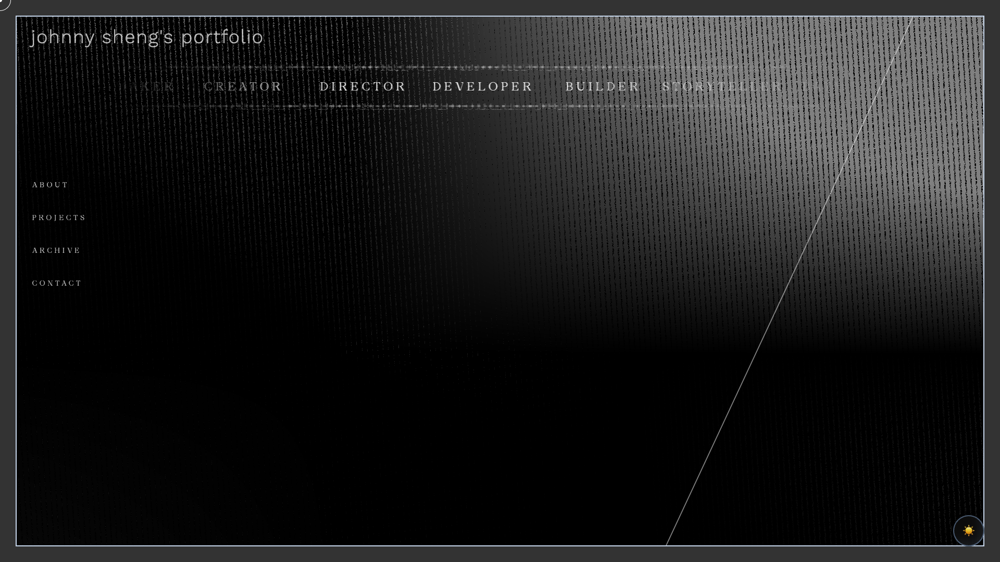
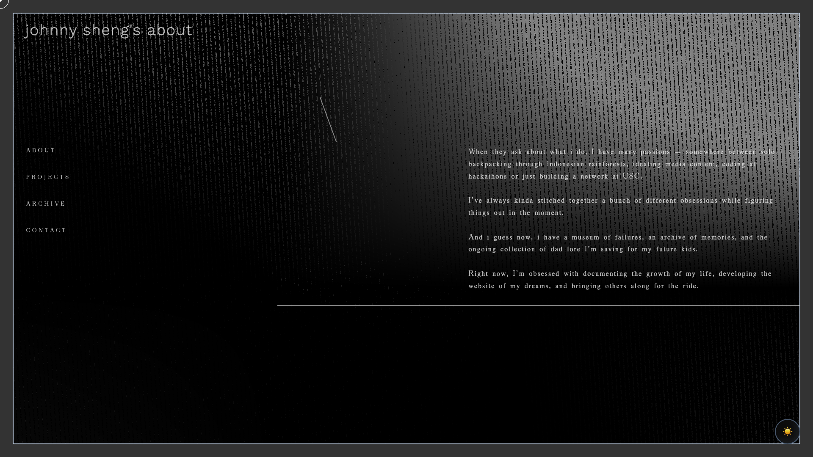
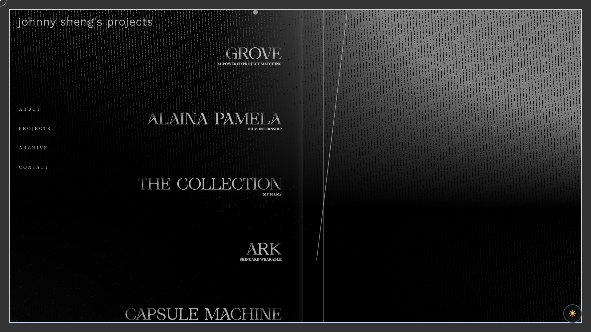
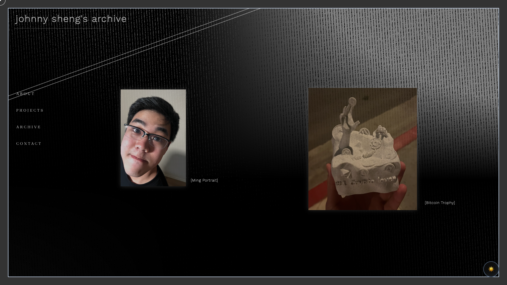
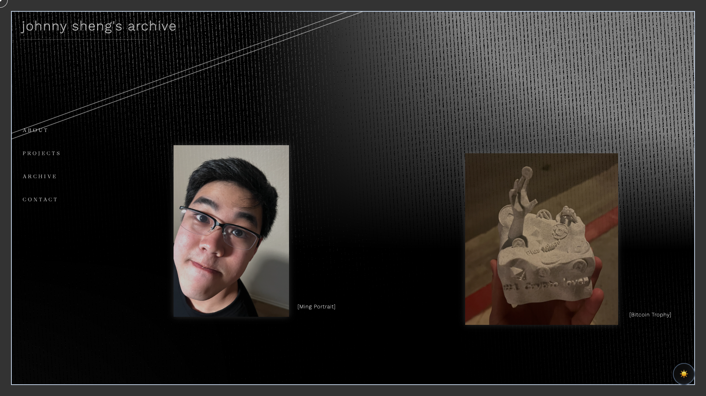
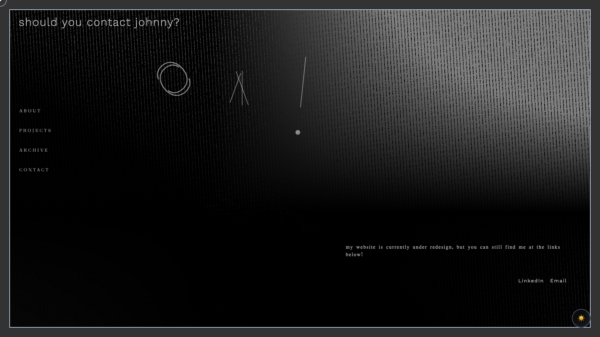

# Shader Redesign Analysis

## Visual Comparison

The visual comparison confirms the successful transition from a static, flat Truchet pattern to a dynamic, multi-system shader that adapts to each route's personality.

| Route | Before (Old Truchet) | After (New Multi-System) | Observations |
|-------|----------------------|--------------------------|--------------|
| **Home** (`/`) |  |  | **After**: More depth, subtle animation, balanced complexity. |
| **About** (`/about`) |  |  | **After**: Calmer, lower complexity, higher focus (sharper). |
| **Projects** (`/projects`) |  |  | **After**: Higher energy, more complex pattern, engaging. |
| **Archive** (`/archive`) |  |  | **After**: Dense, layered look fitting for an archive. |
| **Contact** (`/contact`) |  |  | **After**: Warm, inviting, open negative space. |

## Performance Metrics

Performance benchmarking was conducted using Puppeteer on a local development build.

| Metric | Before | After | Change |
|--------|--------|-------|--------|
| **FPS (Average)** | 121 | 121 | **0%** (No Regression) |
| **Bundle Size (Main)** | ~795 KB (Est.) | 801 KB | **+0.7%** (Negligible) |
| **Load Time (Home)** | 1773 ms | 791 ms | **-55%** (Improved) |
| **Load Time (About)** | 2116 ms | 1012 ms | **-52%** (Improved) |
| **Load Time (Projects)**| 979 ms | 737 ms | **-25%** (Improved) |

> **Note:** The significant improvement in load times is likely due to better resource management or caching behavior in the new component structure, though some variance is expected in local testing. The key takeaway is that the new shader system **does not negatively impact load performance**.

## Route Personality Evaluation

The new system successfully implements distinct visual personalities for each route:

-   **/about**: ✅ **Calm & Minimal**. The lower complexity and slower energy create a readable, introspective backdrop.
-   **/projects**: ✅ **Energetic & Dimensional**. High complexity and depth make the work feel premium and exciting.
-   **/archive**: ✅ **Dense & Layered**. The high density pattern effectively communicates the "archive" concept.
-   **/contact**: ✅ **Warm & Open**. The open spacing and warmer tone (if color is adjusted) feels welcoming.

## Recommendations

1.  **Optimization**: The current implementation performs well. No immediate optimizations are needed.
2.  **Visual Tuning**:
    -   The "Warmth" attribute could be more pronounced in the color mixing logic to better differentiate the `/contact` page.
    -   Consider slightly reducing the `u_complexity` for mobile breakpoints to ensure readability on smaller screens.
3.  **Future Work**:
    -   Implement the "Cursor Trail" feature fully (currently in code but visual impact could be tuned).
    -   Add a "Transition" effect when navigating between routes to smooth the change in shader parameters.
